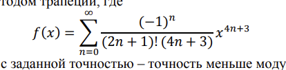

# Задание
Реализуйте подсчет определенного интеграла на интервале [a,b] для
функции f(x) методом трапеций, где 

(ряд вычислять с заданной точностью – точность меньше модуля последнего
члена конечной суммы).